Login page

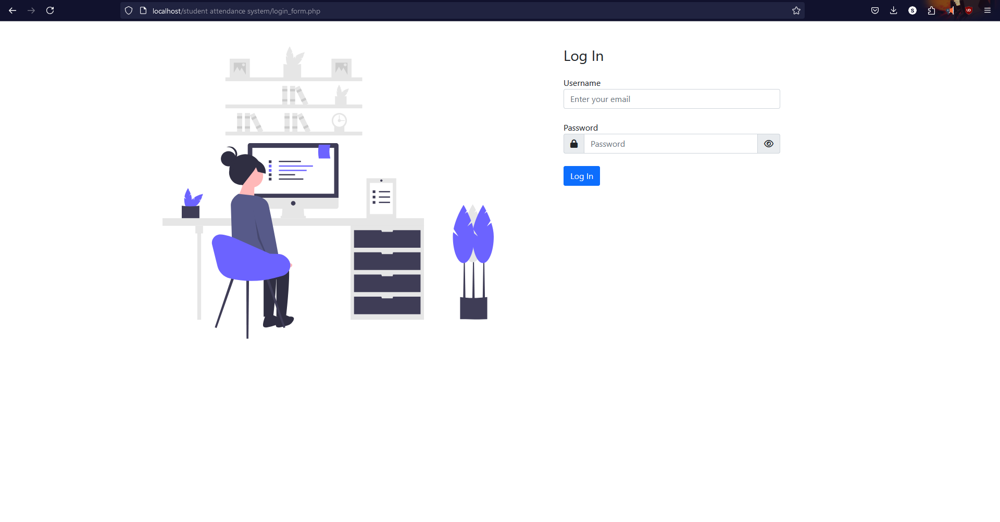

User Dashboard
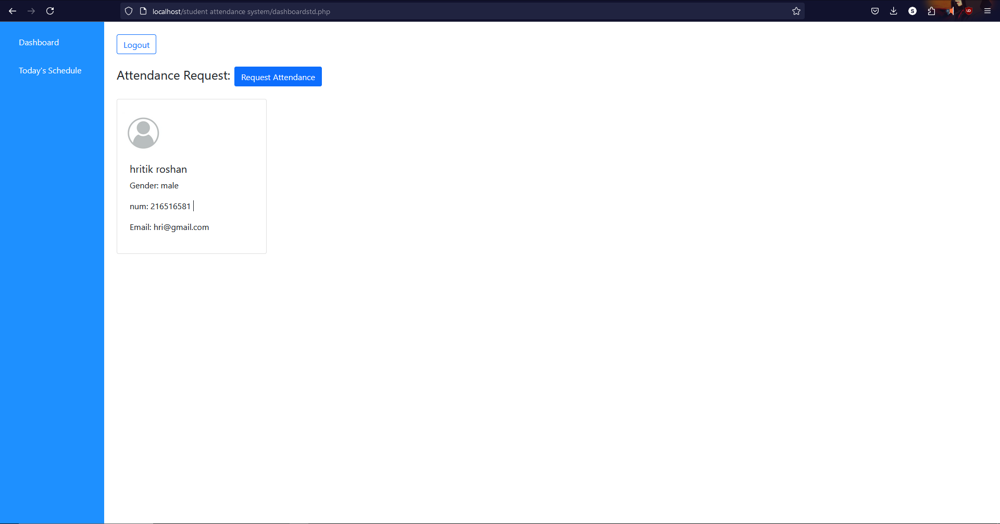

User request for attendance  

Accepted request

Todays schedule
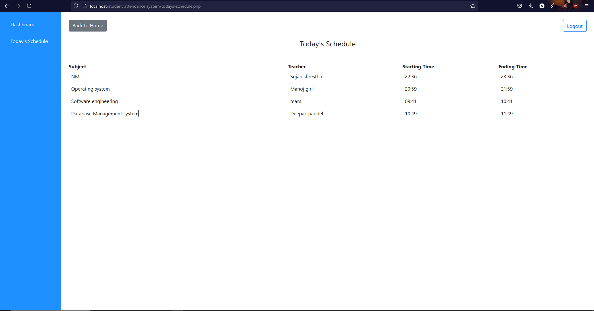

Admin Dashboard
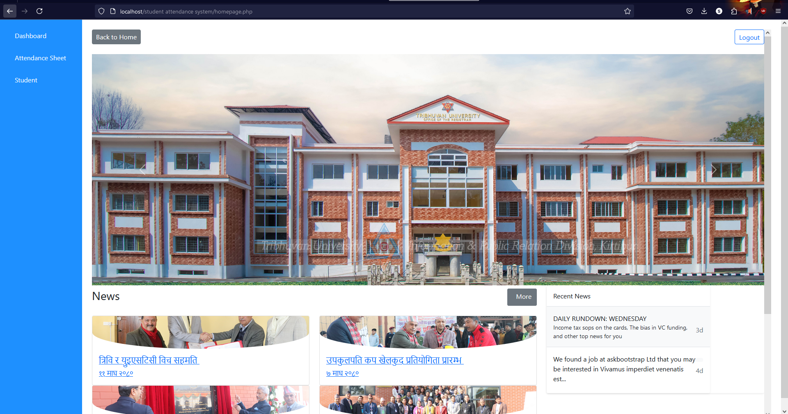

Add Student
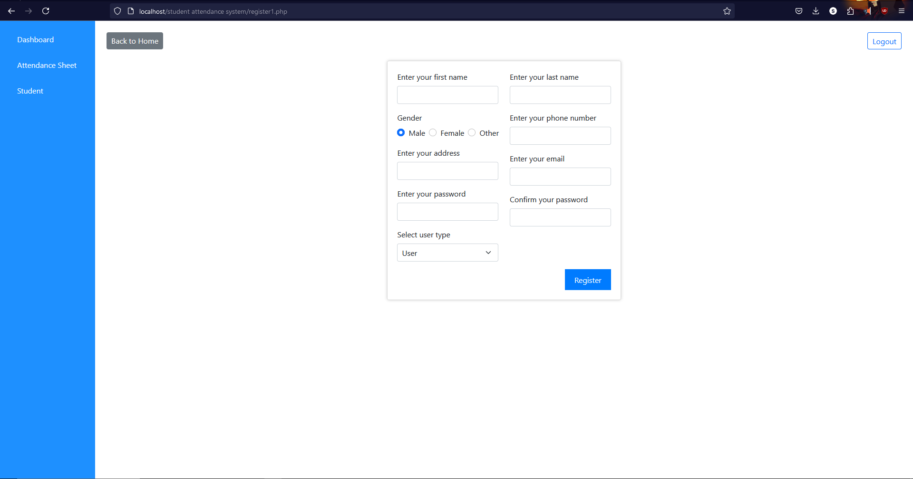

Attendance Sheet
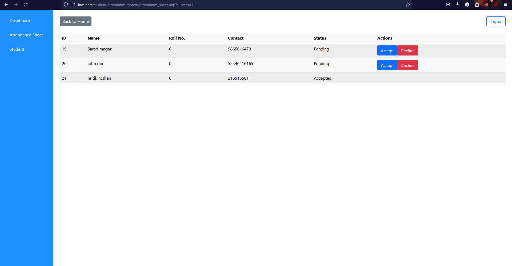

View Student

Assign Roll no.
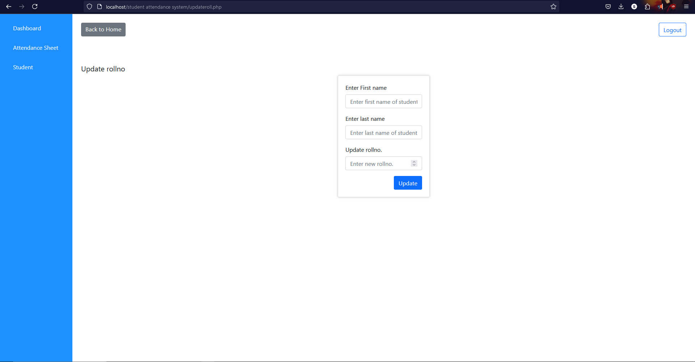

Update Student
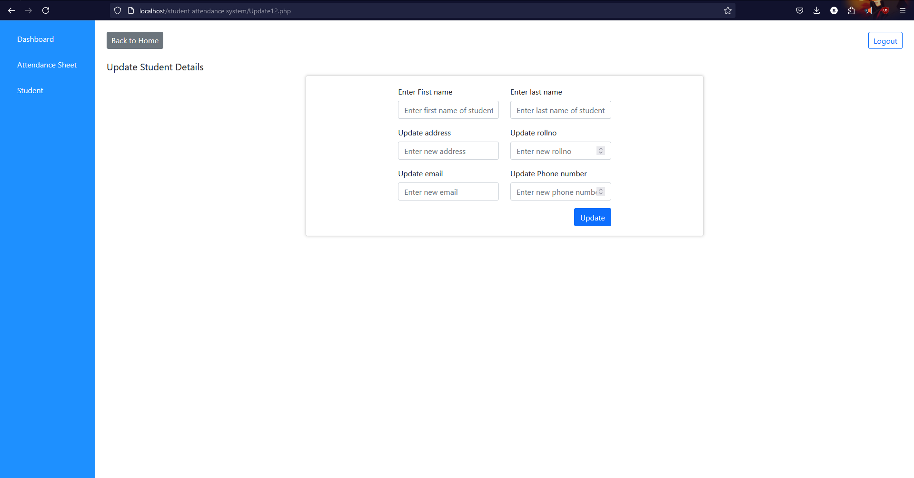

Admin View Schedule
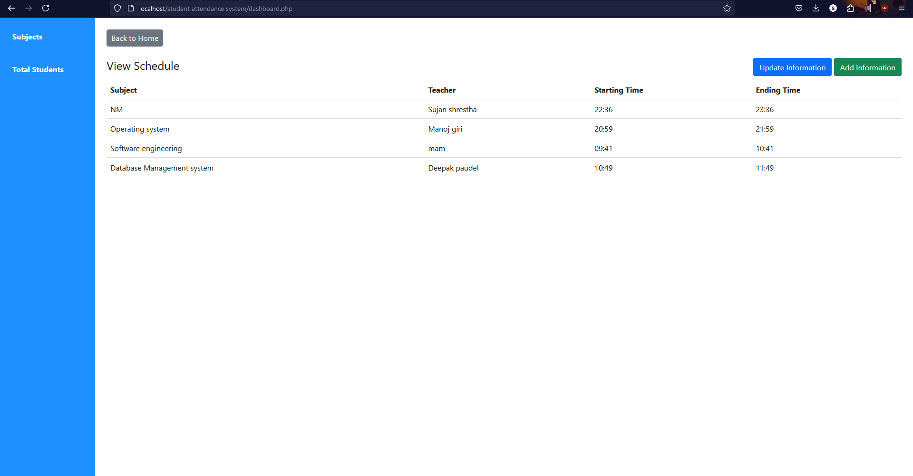

Admin Update Schedule
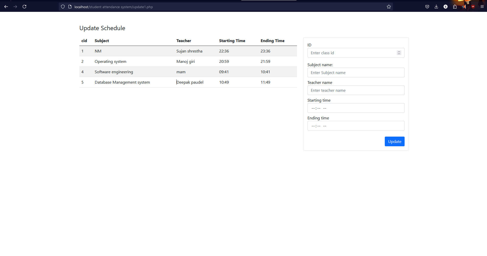

Admin Add Schedule

Admin view attendance according to Date
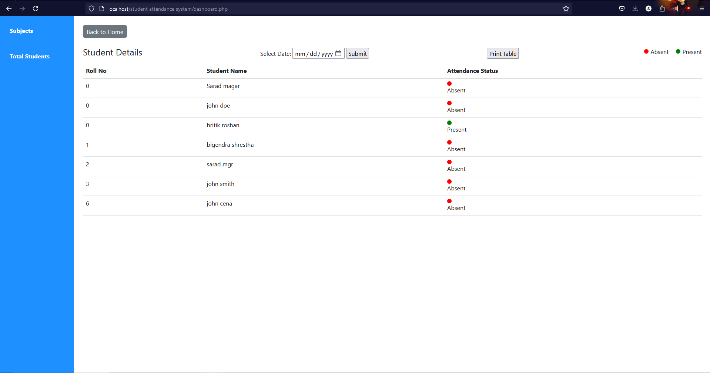

Print Attendance sheet
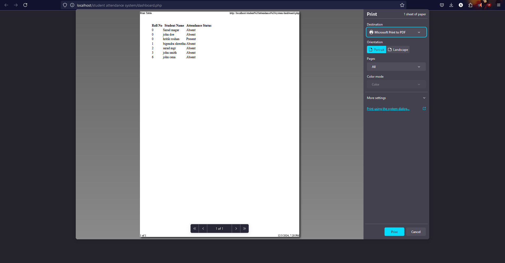
