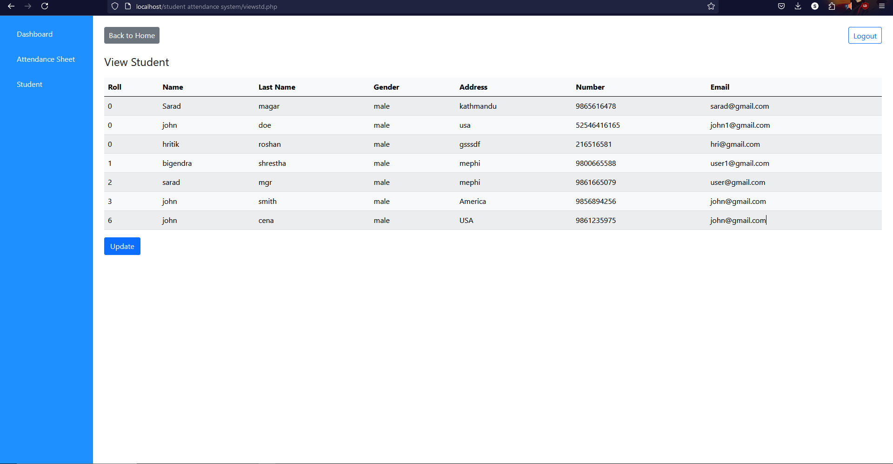
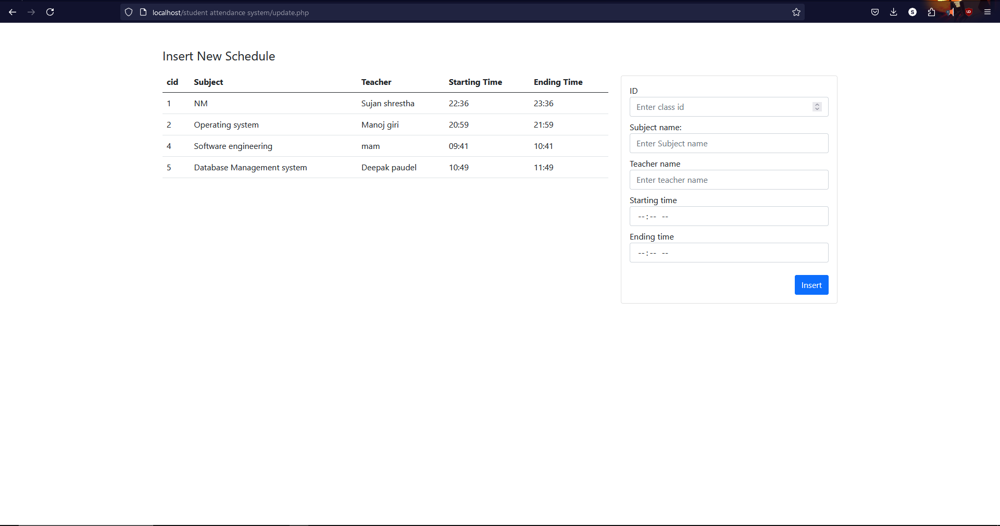

Login page

User Dashboard

User request for attendance  

Accepted request

Todays schedule

Admin Dashboard

Add Student

Attendance Sheet

View Student

Assign Roll no.

Update Student

Admin View Schedule

Admin Update Schedule

Admin Add Schedule

Admin view attendance according to Date

Print Attendance sheet

